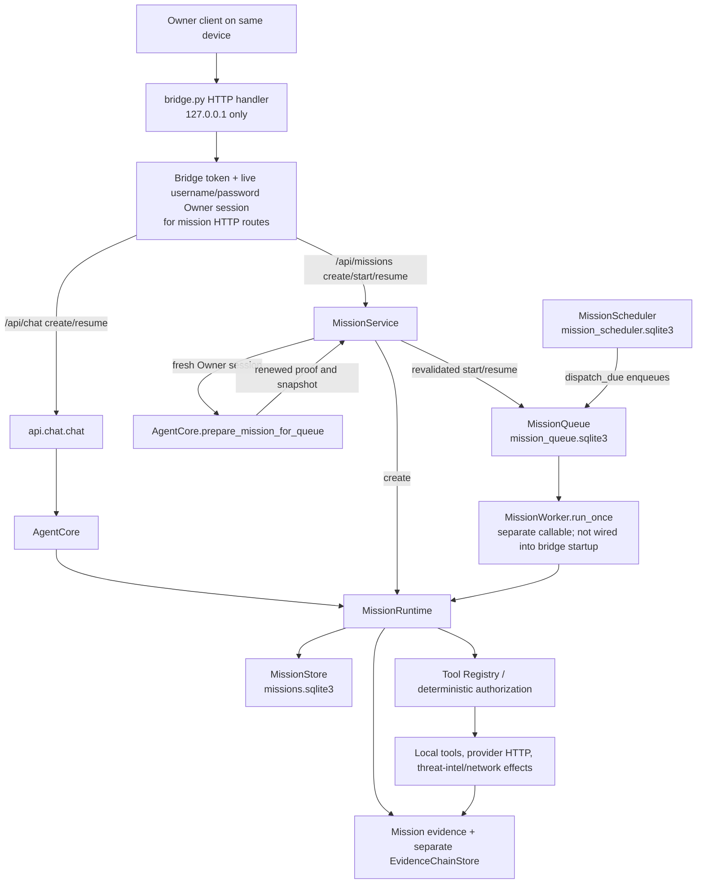

# CyberSentinel M2E Architecture Map

**Source-audit baseline:** checkout `e3c75688584dece1cb71393a884a63dfbecb4613` on `task/m2e-cutover-20261002`. This checkpoint also records the V2 queued-start/resume revalidation change on that branch; it does not claim a running production service or an out-of-band deployment.

## Runtime and request path

CyberSentinel is currently a local Python application. `README.md:3-20` and `docs/OPERATIONS.md:1-14` describe the localhost quick start; `core/config.py:11-18,33-34` defaults to and rejects any bridge bind other than `127.0.0.1`. `bridge.py:416-426` requires `BRIDGE_TOKEN`, constructs `ThreadingHTTPServer`, and blocks in `serve_forever()`. There is no repository-owned process supervisor, shutdown/restart service, platform adapter, or Worker/Pages entrypoint.

The diagram’s queued worker is an available code path, not an active service proven by this checkout. `bridge.py:82-87` constructs a `MissionRuntime`, `MissionQueue`, and `MissionScheduler`; it does not construct `MissionWorker`, call `run_once()`, or run `dispatch_due()`. The only server entrypoint calls `serve_forever()` (`bridge.py:416-426`).

The chat API’s `mission_id` path calls `AgentCore.resume_mission()` (`api/chat.py:90-108`), which authenticates the supplied Owner session against the mission request, renews the authorization snapshot and policy/context, persists revalidation, and then runs the runtime (`agent/agent_core.py:333-391`). V2 closes the corresponding request-time gap for HTTP queueing: `/api/missions/{id}/start` and `/resume` require the bridge token and a live username/password Owner session (`bridge.py:89-97,268-285`), pass its server-side session ID to `MissionService`, and invoke the same AgentCore authentication/snapshot-renewal path before enqueue (`api/missions.py:29-53,84-111`). The prepare-only method persists the renewed proof/context without running a mission slice (`agent/agent_core.py:378-385`). Missing, invalid, or unbound proof fails closed; `RECOVERY_REQUIRED` and other terminal missions are rejected before queueing. No production worker is wired into bridge startup, so this does not establish an active background service or resolve authority for unattended scheduler dispatch or worker restart.

## State, leases, effects, and recovery

| Component | Current boundary | What it proves—and does not prove |
|---|---|---|
| Mission truth | JSON payloads in SQLite; integrity hash, trajectory hash checks, optimistic stale-write rejection (`agent/mission.py:129-189`). | Detects payload tampering and stale/concurrent mission saves; the save carries no queue worker or lease epoch. |
| Queue | SQLite queue rows; `BEGIN IMMEDIATE` claims, `lease_owner`, `lease_epoch`, expiry, and conditional heartbeat/update/release (`agent/mission_worker.py:52-99,101-192`). | Fences stale queue-row mutations. It does not fence a stale writer to the separate mission database. |
| Worker | `run_once()` claims one item, calls `runtime.run_to_completion()`, heartbeats, and parks ambiguous errors in `WAITING_FOR_TOOL` (`agent/mission_worker.py:206-280`). | Safe queue behavior exists as a callable adapter. No startup loop or process-level operational test is present. |
| Scheduler | Separate schedule database; `dispatch_due()` enqueues, then advances the schedule in another transaction (`agent/mission_worker.py:294-334`). | A crash between those writes can leave an enqueue/schedule mismatch; no dispatch idempotency marker is present. |
| Evidence | Mission evidence is stored inside the mission payload. `EvidenceChainStore` separately serializes a sequence and previous/current SHA-256 hashes (`agent/evidence.py:61-99`). | The local chain detects accidental/tampered records unless the entire database is rewritten and rehashed. It is not signed, not lease-bound, and is not atomic with mission or queue state. Native tool results are not automatically appended to this chain. |
| External effects | Registry tools and providers can perform local writes and outbound HTTP. Runtime writes an `in_flight` checkpoint before dispatch and records returned observations after it (`agent/mission_runtime.py:329-375,503-525`). | An exception/timeout may be ambiguous; the code avoids inferring “not executed” from a crash. There is no provider receipt/idempotency ledger or exactly-once guarantee. |
| Reconciliation | `MissionRuntime.reconcile_in_flight()` accepts `executed` plus an optional observation and persists a resolution (`agent/mission_runtime.py:193-239`). | No HTTP reconciliation endpoint or Owner-session parameter was found. Who may attest executed/not-executed remains an Owner decision; the runtime does not independently verify an external receipt. |

The queue, mission, scheduler, and evidence stores are separate persistence boundaries. Consequently, queue acknowledgement, mission-state save, evidence append, schedule advancement, and an external provider effect cannot be claimed as one atomic transaction. Queue fencing must not be described as unified mission/effect fencing. The runtime’s in-flight checkpoint/reconciliation behavior prevents blind replay but does not provide exactly-once execution.

## Authorization and model/tool boundary

Owner username/password sessions are server-side records with expiry and revocation (`security/owner_password.py:142-211`). Mission HTTP routes check both bridge authentication and a valid Owner session (`bridge.py:89-97,162-175,244-290`). The application has one canonical Owner account; the checked-in routes do not establish a multi-tenant mission-owner model. Structured-plan mission creation still uses the literal `owner-password-session` identity reference and route snapshot factory (`bridge.py:259-260,99-106`), but V2 now rebinds queue start/resume to a fresh session proof and policy snapshot before enqueue. `MissionService.create_mission()` supplies a server-generated UUID request ID when one is absent, matching the existing chat path convention (`api/missions.py:29-32`; `api/chat.py:102-106`).

`AuthorizationContext` requires typed, request-bound Owner evidence and a policy snapshot (`security/authorization_context.py:23-52`). `AuthorizationDecision` is HMAC-signed and binds tool, request ID, expiry, and argument fingerprint (`security/authorization_context.py:122-177`); `tools.registry.execute()` is the deterministic execution boundary. `MissionRuntime` checks authorization snapshots against mission/owner/target/version/action/tool and scope boundaries (`agent/mission_runtime.py:36-62`). V2 uses fresh Owner revalidation for the synchronous chat resume and authenticated HTTP queue start/resume paths; scheduled dispatch and a worker process resuming independently still have no source-established live Owner authority model.

The provider adapter currently normalizes malformed JSON tool arguments to `{}` and silently skips calls with non-string tool names (`agent/providers.py:62-86`). Native execution extracts only `arguments.query` and records success evidence without an execution-proof object or a durable link to the authorization decision and queue claim (`agent/mission_runtime.py:335-365`). Plan metadata is serialized, but the native model loop does not enforce proposal plan-version/step identity against the active step. There is no `ExecutionProof` type, verifier, or durable proof schema in this checkout; the trust model and required proof fields need an explicit design before adding one.

## CI and deployment boundary

`.github/workflows/tests.yml:1-60` is Python test/compile/secret-scan CI. At the initial source baseline, the isolated local run completed **718 passed, 1 skipped**. The V2 local run completed **723 passed, 1 skipped**, followed by `compileall` and `git diff --check`. At V2 commit `4e7a70ad986f0cf150a7a659e1646b1f3b97900b`, exact-SHA GitHub Actions `tests` run `37084032848` (check `111090497325`) and `owner-charter-audit` run `37084032823` (check `111090497193`) both completed `success`. `.github/workflows/github-only-poc.yml:1-105` is a manually dispatched, bounded Python job with an optional real-provider run and non-secret artifact; `docs/GITHUB_ONLY_DEPLOYMENT_ANALYSIS.md:69-92` explicitly describes it as a batch/POC, not a public backend.

The repository inventory and source audit found no `wrangler.toml`, `wrangler.json/jsonc`, Cloudflare Worker module, Pages Functions tree, Workers Builds deployment workflow, or Cloudflare deployment command. The checked-out dependencies and workflows are Python-only. The Cloudflare preview build `a4800e34-d7dd-45e6-94b2-1d73018617c2` for SHA `e3c75688584dece1cb71393a884a63dfbecb4613` failed at the Wrangler configuration check with `preview_url=null`; that attempt remains failed. A push-triggered V1 Cloudflare check `111087253066` for SHA `0aa4f5de6a40285d1ec9ce247dee4d535ea87c44` completed as `failure` (external build `78383d09-1a63-4449-84c9-767dd22d7b50`) without a preview URL or cause. V2 check `111090499896` for SHA `4e7a70ad986f0cf150a7a659e1646b1f3b97900b` was independently rechecked at 2026-10-03 03:08:14 +02:00 and remained `in_progress`, `conclusion=null` (external build `947628a8-a733-4c4e-8660-707aee088686`); the GitHub summary contains no result, preview URL, or failure cause, while the details path includes `/production/builds`. That path is not evidence of a production deployment; external effect remains `UNKNOWN`. No Cloudflare configuration, settings, or direct build/deployment API was changed or invoked, and this unknown check does not gate independent local work.

## Decisions that cannot be inferred safely

The code does not choose whether the canonical runtime should remain the localhost Python bridge, move to Workers/Pages, or use another persistent backend. It also does not define a durable state migration, an unattended worker/scheduler ownership model or its fresh Owner authority, who may reconcile ambiguous external effects, whether execution proof is tamper-evident or adversary-resistant, or whether cross-store consistency must be atomic. Those choices remain `BLOCKED / OWNER DECISION REQUIRED`; this map does not invent platform, approval, credential, or deployment semantics.
