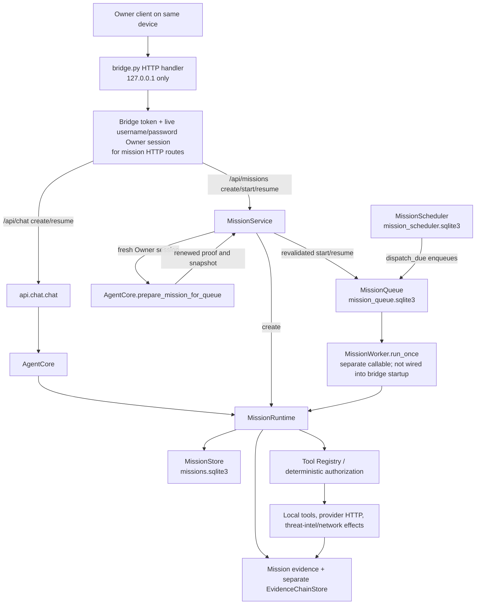

# CyberSentinel M2E Architecture Map

**Source-audit baseline:** initial inventory at `e3c75688584dece1cb71393a884a63dfbecb4613`; V3 queue-fencing checkpoint `38f784e7f247906ffa2368332262a4c072ca11dd` is pushed to the M2E branch. V4 remains `BLOCKED / OWNER DECISION REQUIRED` for Mission/Queue atomicity. This map does not claim a running production service, an out-of-band deployment, or any production outcome.

## Runtime and request path

CyberSentinel is currently a local Python application. `README.md:3-20` and `docs/OPERATIONS.md:1-14` describe the localhost quick start; `core/config.py:11-18,33-34` defaults to and rejects any bridge bind other than `127.0.0.1`. `bridge.py:416-426` requires `BRIDGE_TOKEN`, constructs `ThreadingHTTPServer`, and blocks in `serve_forever()`. There is no repository-owned process supervisor, shutdown/restart service, platform adapter, or Worker/Pages entrypoint.

The diagram’s queued worker is an available code path, not an active service proven by this checkout. `bridge.py:82-87` constructs a `MissionRuntime`, `MissionQueue`, and `MissionScheduler`; it does not construct `MissionWorker`, call `run_once()`, or run `dispatch_due()`. The only server entrypoint calls `serve_forever()` (`bridge.py:416-426`).

The chat API’s `mission_id` path calls `AgentCore.resume_mission()` (`api/chat.py:90-108`), which authenticates the supplied Owner session against the mission request, renews the authorization snapshot and policy/context, persists revalidation, and then runs the runtime (`agent/agent_core.py:333-391`). V2 closes the corresponding request-time gap for HTTP queueing: `/api/missions/{id}/start` and `/resume` require the bridge token and a live username/password Owner session (`bridge.py:89-97,268-285`), pass its server-side session ID to `MissionService`, and invoke the same AgentCore authentication/snapshot-renewal path before enqueue (`api/missions.py:29-53,84-111`). The prepare-only method persists the renewed proof/context without running a mission slice (`agent/agent_core.py:378-385`). Missing, invalid, or unbound proof fails closed; `RECOVERY_REQUIRED` and other terminal missions are rejected before queueing. No production worker is wired into bridge startup, so this does not establish an active background service or resolve authority for unattended scheduler dispatch or worker restart.

## State, leases, effects, and recovery

| Component | Current boundary | What it proves—and does not prove |
|---|---|---|
| Mission truth | JSON payloads in SQLite; integrity hash, trajectory hash checks, optimistic stale-write rejection (`agent/mission.py:129-189`). | Detects payload tampering and stale/concurrent mission saves; the save carries no queue worker or lease epoch. |
| Queue | SQLite queue rows; aware UTC timestamps are normalized and legacy time fields migrated before lexical SQL comparisons; `BEGIN IMMEDIATE` claims return their own transaction snapshot, and every worker update/release/heartbeat requires the current live owner and epoch (`agent/mission_worker.py:39-110,136-174,176-310`; adversarial coverage in `tests/test_lease_fencing.py:211-387`). | Fences queue-row mutations against offset-format expiry errors, stale claim refetch, and unfenced state changes. It still does not fence MissionStore, evidence, or provider effects. |
| Worker | `run_once()` validates the claimed lease before runtime construction and again before dispatch, then passes a fenced heartbeat into runtime slices. V8 maps `RECOVERY_REQUIRED` to non-claimable `WAITING_FOR_TOOL` through fenced `release()`, clearing `claimed_at`/owner/expiry while preserving the lease epoch (`agent/mission_worker.py:345-408`; recovery regression `tests/test_v8_recovery_quarantine.py:11-42`). | Unknown work is durably parked without a live lease and is not re-claimed after restart. This is queue quarantine, not proof or resolution of the external effect; a separate mission/effect fence remains absent. No supervisor startup loop or process-level operations test is present. |
| Scheduler | Schedule times are normalized/migrated to UTC before due-time comparison (`agent/mission_worker.py:422-476`). `dispatch_due()` still enqueues and advances the separate schedule database in separate writes. | Offset-formatted due times compare correctly; a crash between queue enqueue and schedule advancement can still leave a mismatch, with no dispatch idempotency marker (V4 follow-up). |
| Evidence | Mission evidence is stored inside the mission payload. `EvidenceChainStore` separately serializes a sequence and previous/current SHA-256 hashes (`agent/evidence.py:61-99`). | The local chain detects accidental/tampered records unless the entire database is rewritten and rehashed. It is not signed, not lease-bound, and is not atomic with mission or queue state. Native tool results are not automatically appended to this chain. |
| External effects | Registry tools and providers can perform local writes and outbound HTTP. `MissionRuntime` writes `in_flight` before dispatch (`agent/mission_runtime.py:329-375,525-547`). V7 also makes `AgentTaskRuntime` persist a per-call Task-row intent (`tool_call_id`, request/session, risk class, argument SHA-256; no raw argument) before executor dispatch, and parks restart/exception/non-success ambiguity without another model call (`agent/task.py:85-121`; `agent/task_runtime.py:210-347,383-392,499-506`). V10 adds task-row optimistic version fencing and keeps a synchronous active slice non-claimable (`agent/task_manager.py:84-186`; `agent/task_runtime.py:362-497`). | These are durable local replay/stale-write barriers, not proof that an external side effect occurred or exactly-once execution. There is no provider receipt/idempotency ledger or approved external-effect contract. TaskManager still has no lease owner/epoch/expiry or durable process-recovery lease. |
| Reconciliation | `MissionRuntime.reconcile_in_flight()` still accepts `executed` plus an optional unverified observation (`agent/mission_runtime.py:193-239`). V8 leaves this resolver unchanged and only hardens queue parking: `WAITING_FOR_TOOL` is outside the claimable set and restart recovery only resets expired `EXECUTING` claims (`agent/mission_worker.py:136-174,287-314`). V9 makes both `run_slice()` and `run_model_loop()` quarantine `in_flight` and `in_flight_parallel` (`agent/mission_runtime.py:241-253,452-480`; regressions `tests/test_v9_crash_injection.py:45-85,210-274`). | There is no source-established receipt verifier, Owner-session-bound decision, or TaskRuntime resolver for an unknown outcome. Mission reconciliation still trusts a bare boolean; evidence and authority semantics remain `BLOCKED / OWNER DECISION REQUIRED`. No retry is enabled by V8/V9. |

The queue, mission, scheduler, evidence, and TaskManager stores are separate persistence boundaries. Consequently, queue acknowledgement, mission/task-state save, evidence append, schedule advancement, and an external provider effect cannot be claimed as one atomic transaction. Queue fencing must not be described as unified mission/effect fencing. The mission and task runtimes have distinct in-flight barriers; neither provides exactly-once execution. V10's task row version rejects stale whole-row overwrites and its transaction keeps an active synchronous slice unclaimable, but the compatibility TaskManager still lacks a lease owner/epoch/expiry and process-restart recovery contract.

## Authorization and model/tool boundary

Owner username/password sessions are server-side records with expiry and revocation (`security/owner_password.py:142-211`). Mission HTTP routes check both bridge authentication and a valid Owner session (`bridge.py:89-97,162-175,244-290`). The application has one canonical Owner account; the checked-in routes do not establish a multi-tenant mission-owner model. Structured-plan mission creation still uses the literal `owner-password-session` identity reference and route snapshot factory (`bridge.py:259-260,99-106`), but V2 now rebinds queue start/resume to a fresh session proof and policy snapshot before enqueue. `MissionService.create_mission()` supplies a server-generated UUID request ID when one is absent, matching the existing chat path convention (`api/missions.py:29-32`; `api/chat.py:102-106`).

`AuthorizationContext` requires typed, request-bound Owner evidence and a policy snapshot (`security/authorization_context.py:23-52`). `AuthorizationDecision` is HMAC-signed and binds tool, request ID, expiry, and argument fingerprint (`security/authorization_context.py:122-177`); `tools.registry.execute()` is the deterministic execution boundary. `MissionRuntime` checks authorization snapshots against mission/owner/target/version/action/tool and scope boundaries (`agent/mission_runtime.py:36-62`). V2 uses fresh Owner revalidation for the synchronous chat resume and authenticated HTTP queue start/resume paths; scheduled dispatch and a worker process resuming independently still have no source-established live Owner authority model.

The provider adapter currently normalizes malformed JSON tool arguments to `{}` and silently skips calls with non-string tool names (`agent/providers.py:62-86`). Native execution extracts only `arguments.query` and records success evidence without an execution-proof object or a durable link to the authorization decision and queue claim (`agent/mission_runtime.py:335-365`). Plan metadata is serialized, but the native model loop does not enforce proposal plan-version/step identity against the active step. There is no `ExecutionProof` type, verifier, or durable proof schema in this checkout; the trust model and required proof fields need an explicit design before adding one.

## CI and deployment boundary

`.github/workflows/tests.yml:1-60` is Python test/compile/secret-scan CI. At the initial source baseline, the isolated local run completed **718 passed, 1 skipped**. V2 completed **723 passed, 1 skipped**; the locally validated V3 worktree over e926 completed **732 passed, 1 skipped in 9.83s**, with focused V3 regressions **63 passed in 1.61s**, `compileall`, and `git diff --check` passing. V3 remains local and has no hosted exact-SHA CI result yet. At V2 commit `4e7a70ad986f0cf150a7a659e1646b1f3b97900b`, exact-SHA GitHub Actions `tests` run `37084032848` (check `111090497325`) and `owner-charter-audit` run `37084032823` (check `111090497193`) both completed `success`. `.github/workflows/github-only-poc.yml:1-105` is a manually dispatched, bounded Python job with an optional real-provider run and non-secret artifact; `docs/GITHUB_ONLY_DEPLOYMENT_ANALYSIS.md:69-92` explicitly describes it as a batch/POC, not a public backend.

The repository inventory and source audit found no `wrangler.toml`, `wrangler.json/jsonc`, Cloudflare Worker module, Pages Functions tree, Workers Builds deployment workflow, or Cloudflare deployment command. The checked-out dependencies and workflows are Python-only. The Cloudflare preview build `a4800e34-d7dd-45e6-94b2-1d73018617c2` for SHA `e3c75688584dece1cb71393a884a63dfbecb4613` failed at the Wrangler configuration check with `preview_url=null`; that attempt remains failed. A push-triggered V1 Cloudflare check `111087253066` for SHA `0aa4f5de6a40285d1ec9ce247dee4d535ea87c44` completed as `failure` (external build `78383d09-1a63-4449-84c9-767dd22d7b50`) without a preview URL or cause. V2 code SHA `4e7a70ad986f0cf150a7a659e1646b1f3b97900b` check `111090499896` remained `in_progress`, `conclusion=null` at the independent 03:31:16 +02:00 query (external build `947628a8-a733-4c4e-8660-707aee088686`). The separate V2 state checkpoint SHA `e9265647cb469150ad813657be4bab3d9ba9550a` passed exact-SHA GitHub Actions `test` (run `37085180611`, check `111093865980`) and `audit` (run `37085180635`, check `111093866140`); its Workers check `111093936774` completed `failure` (external build `5f7643af-2d11-496d-a00b-26e571bc926e`) with no cause or preview URL. Both Workers summaries give only build/script links; paths under `/production/builds` do not prove a production deployment. GitHub deployments queries returned no records for `4e7a70a` or `e926564` at 03:13:19 +02:00; that evidence is limited to GitHub and does not establish Cloudflare state. External effect remains `UNKNOWN`; no Cloudflare configuration, settings, direct build/deployment API, cancellation, or retry was used. Do not overlap a new remote M2E push with the still-in-progress `111090499896`; independent local V3 work is checkpointed but not pushed.

## Decisions that cannot be inferred safely

The code does not choose whether the canonical runtime should remain the localhost Python bridge, move to Workers/Pages, or use another persistent backend. It also does not define a durable state migration, an unattended worker/scheduler ownership model or its fresh Owner authority, who may reconcile ambiguous external effects, whether execution proof is tamper-evident or adversary-resistant, or whether cross-store consistency must be atomic. Those choices remain `BLOCKED / OWNER DECISION REQUIRED`; this map does not invent platform, approval, credential, or deployment semantics.

### Terminal result for prior V2 Workers check — 2026-10-03 03:48 +02:00

Owner-supplied independent read-only Cloudflare API evidence reports exact V2 code SHA `4e7a70ad986f0cf150a7a659e1646b1f3b97900b`, branch `task/m2e-cutover-20261002`, build `947628a8-a733-4c4e-8660-707aee088686`: terminal `fail`, command `npx wrangler preview`, cause missing top-level `previews` configuration, `preview_url=null`. The branch Preview record has `auto_build=true`; the queried Preview deployments endpoint returned `total_count=0`. Classification is confirmed preview-build failure; zero records is limited to that endpoint query and does not establish overall production state. No retry or Cloudflare mutation was performed.

First-parent boundaries are V3 checkpoint `38f784e7f247906ffa2368332262a4c072ca11dd`, V4 blocked-state commit `a79773e1c0fd7162df5e21a43760f1bd0a9158a1`, and V5 code commit `435ddcfa9c1dbf938bc1d3c58aa9c6d85436b749` (latest local state/map descendant `df455fb7782e480ba7723a5fa6935502e1d90469`). The V3 push must target 38f only; V4 and V5 remain separate later checkpoints. No production-state claim is made.

### V3 exact-SHA hosted checks — 2026-10-03 03:51 +02:00

After non-force push of V3 checkpoint `38f784e7f247906ffa2368332262a4c072ca11dd`, GitHub confirmed that exact remote M2E head. Exact-SHA `owner-charter-audit` run `37087663916` passed; `tests` run `37087663913` / check `111101185308` and the naturally triggered Workers check `111101190438` were still `in_progress` at 03:51:36. The Workers external build ID is `5dadb20d-402d-46e9-a97b-0ce7ef23e39f`; no final result or preview URL was yet available. The V3 preview remains unknown/nonterminal; no manual trigger or retry occurred.

The separate previous V2 code-SHA build `947628a8-a733-4c4e-8660-707aee088686` is confirmed failed by the owner's independent read-only Cloudflare API evidence: command `npx wrangler preview`, missing top-level `previews` config, `preview_url=null`, and queried Preview deployments endpoint `total_count=0`. This is a confirmed preview-build failure and no-preview-record result for that query, not a conclusion about overall production state. V4 and V5 remain separate later checkpoints.

### V3 CI follow-up — 2026-10-03 04:24 +02:00

The exact-SHA `tests` run `37087663913` / check `111101185308` and `owner-charter-audit` run `37087663916` completed successfully for V3 SHA `38f784e7f247906ffa2368332262a4c072ca11dd`. A direct read-only GET by Workers check ID `111101190438` at 04:24:31 confirmed `status=in_progress`, `conclusion=null`, external build `5dadb20d-402d-46e9-a97b-0ce7ef23e39f`; no terminal result or preview URL was reported. The V3 preview/build outcome remains `UNKNOWN` while nonterminal. No V4/V5 push, manual build, Cloudflare mutation, retry, or production operation occurred.

The preceding bounded monitor timed out after 30 minutes because its filtered check-list responses included the test check but omitted the Workers check; the direct exact-ID query resolved its current status without inferring the final result. This monitoring failure is recorded in `docs/M2E_STATE.md` and must not be conflated with the prior V2 preview build, which independently failed for missing top-level `previews` configuration.

### V3 terminal preview observation and V4 boundary — 2026-10-03 04:26–04:27 +02:00

The Owner's independent Cloudflare API evidence reports V3 build `5dadb20d-402d-46e9-a97b-0ce7ef23e39f` for SHA `38f784e7f247906ffa2368332262a4c072ca11dd` as terminal `fail` under `npx wrangler preview` because the existing Python repository has no Wrangler `previews` block. The branch preview-deployments API returned `total_count=0` and `preview_url` was absent. This is classified as a confirmed preview-build failure; the API result is limited to the queried preview endpoint and does not establish production state. No retry or Cloudflare API call was made by this agent.

For the same V3 SHA, GitHub Actions `tests` run `37087663913` / check `111101185308` and `owner-charter-audit` run `37087663916` / check `111101185368` are successful. A separate GitHub GET at 04:27:54 still showed Workers check `111101190438` as `in_progress` with no conclusion. Both provider-build and GitHub-check observations are preserved separately; no success or production inference is made from the GitHub check's nonterminal state.

V4 remains a documentation-only `BLOCKED / OWNER DECISION REQUIRED` checkpoint for unresolved Mission/Queue atomicity authority. No source/owner decision was supplied, so no architectural change is made. V4 is pushed as the next M2E checkpoint before V5; V5/V6 code is excluded from this V4 tip.

### V4 exact-SHA checks terminal — 2026-10-03 04:32 +02:00

For V4 SHA `a5cbb828cc59d816a1845ae8edf8dcb6477bfc08`, GitHub audit run `37090085541` / check `111108378136` and test run `37090085552` / check `111108378436` completed successfully. The naturally triggered Workers check `111108436527` completed `failure`, external build `fa23f980-a3f7-4683-99ae-5b2f9e0cd43f`; GitHub reported no cause or preview URL. This confirms a failed Workers Build check, not a production outcome or any specific preview artifact state.

The separate GitHub commit-status endpoint returned `pending` with no status records at 04:32:43, although exact check-run records were terminal. The check-run statuses are kept explicit and separate. V4 remains a docs-only `BLOCKED / OWNER DECISION REQUIRED` checkpoint; no V4 architecture/code choice was made.

## V5 evidence append serialization checkpoint

`EvidenceChainStore.append()` now begins with SQLite `BEGIN IMMEDIATE` before reading the current chain head, assigning the sequence/previous hash, and inserting the rehashed record (`agent/evidence.py:69-83`). This serializes concurrent appenders at the chain-position boundary. The focused tests verify rehashing, 64 concurrent appends across eight store instances with one valid sequence, detection of payload tampering, and rollback after non-JSON serialization failure (`tests/test_evidence_chain_store.py:8-84`).

This is a narrow V5 integrity improvement, not full worker-lease fencing or adversary-resistant authenticity. The chain remains unkeyed SHA-256, can be recomputed by a database writer, is stored separately from mission/queue state, and native mission evidence is not automatically appended to it. Binding evidence writes to a live worker claim still depends on the unresolved V4 storage/transaction decision; do not claim unified mission, queue, evidence, or external-effect atomicity.

### Historical read-only CI observation — 2026-10-03 03:45 +02:00

At 03:45:01, GitHub check `111090499896` for V2 code SHA `4e7a70ad986f0cf150a7a659e1646b1f3b97900b` was `in_progress`, `conclusion=null` (external build `947628a8-a733-4c4e-8660-707aee088686`). This is the status of that GitHub check at the query time, not a preview/deployment result. The Owner later supplied independent terminal Cloudflare failure evidence for this exact build, recorded above. The old local branch-tip and push-gating instructions from this snapshot are superseded by the verified V4 and current V5 checkpoints.

## V9 crash-injection matrix — local implementation (2026-10-03)

`MissionRuntime.run_slice()` now treats both `in_flight` and `in_flight_parallel` checkpoints as ambiguous and transitions them to `RECOVERY_REQUIRED` before plan execution (`agent/mission_runtime.py:452-480`). This closes a cross-entrypoint gap: `run_model_loop()` already rejected parallel in-flight checkpoints, but plan-loop resume previously guarded only the single-call status. Parallel call IDs are retained in failure/recovery metadata; no execution proof or reconciliation authority is added.

`tests/test_v9_crash_injection.py:45-85` exercises both checkpoint classes through both public runtime entrypoints. Lines 88-155 inject abrupt `BaseException` death after the write-ahead save but before dispatch, after a simulated effect, and after executor return but before observation persistence; a fresh worker/runtime over the same SQLite stores must park the recovered mission and must not replay. Lines 158-207 inject queue-ack death before commit and after commit-before-return; a durable terminal mission remains terminal and its effect is not repeated. Lines 210-274 inject death during parallel dispatch and verify that both model-loop and plan-loop resume remain quarantined.

These are deterministic Python-level failpoint tests using an in-memory effect counter and persistent SQLite test stores; they are **not** OS-level process-kill, power-loss, disk-corruption, or true multi-process crash tests. They establish no exactly-once guarantee, no cross-store atomicity, and no evidence-backed or Owner-authorized reconciliation. V4 atomicity and V6/V8 authority/proof blockers remain unchanged; multi-worker concurrency adversarial coverage remains V10.

## V10 multi-worker adversarial hardening — local implementation (2026-10-03)

`TaskManager` schema migration adds `task_version INTEGER NOT NULL DEFAULT 0`. New task writes insert at version zero; subsequent whole-row saves run under `BEGIN IMMEDIATE`, require the snapshot version to match, and increment it. A stale snapshot raises `TaskVersionConflictError` rather than replacing a newer row. The update path does not insert a missing row; only explicit creation may insert, so a stale version-zero snapshot cannot resurrect a deleted task. `claim_task()` now performs its eligible-state read and `QUEUED`/waiting/paused-to-`EXECUTING` transition in one immediate transaction and increments the same row version. Pause/cancel requests use narrow owner-session-checked control updates and bump the version. A pause request does not make an already `EXECUTING` task claimable; terminal rows are not reverted by control requests. The compatibility API omits this internal version from its public task dictionary (`agent/task.py:53,64-68`; `agent/task_manager.py:78-186`; `api/chat.py:32-36,66-89`).

`AgentTaskRuntime.run_slice()` leaves a claimed task `EXECUTING` throughout its synchronous model/tool slice and makes it waiting only after dispatch has yielded; another runtime therefore cannot treat an active model call as a resumable `WAITING_FOR_MODEL` task. It rechecks the row version after the model returns. If an Owner pause/cancel races the active slice, the runtime yields from the durable control flags before it can overwrite the row; a queued pause/cancel therefore takes effect at a slice boundary (`agent/task_runtime.py:362-497`).

`tests/test_v10_multiworker_adversarial.py:50-276` covers two OS child processes racing to claim one task, stale row rejection and deleted version-zero non-resurrection, migration of a legacy table with version zero, ten queue clients competing for six rows, two runtime instances racing while one model call is blocked, active-slice pause/cancel races, and Owner-bound control. The queue multi-client test uses distinct SQLite-backed clients/threads; only the TaskManager claim test uses separate processes. These checks establish serialization for the exercised row/claim paths, not a general distributed lease or exactly-once effect guarantee.

**Remaining boundary:** TaskManager still has no lease owner, lease epoch, expiry, or restart recovery for a row stranded in `EXECUTING` after process death. MissionQueue and TaskManager remain separate stores; no cross-store atomicity, provider receipt, external idempotency, proof binding, Owner-authorized reconciliation, production deployment, or production state is established. V4 cross-store atomicity and the later recovery/authority decisions remain blockers where applicable.

### V11 — Owner cutover and recovery decision gate

The bridge resolves a live server-side Owner session for mission actions; the mission service binds eligible start/resume operations to typed request/session evidence, but the route surface has no reconciliation action (`bridge.py:76-80,89-97,268-297`; `security/owner_password.py:165-211`; `api/missions.py:84-111`). Below that boundary, `MissionRuntime.reconcile_in_flight()` still trusts a bare `executed` boolean and optional unverified observation, including a default successful observation for `executed=True` (`agent/mission_runtime.py:193-239`). The mission service rejects queueing `RECOVERY_REQUIRED` both before and after reauthorization; V8/V9 keep the unresolved queue state non-claimable and prevent runtime replay (`api/missions.py:84-111`; `agent/mission_worker.py:136-174,345-408`; `tests/test_v8_recovery_quarantine.py:11-42`; `tests/test_v9_crash_injection.py:45-85,210-274`).

Current Owner evidence is request/session-bound and time-limited but signed with a random process-local HMAC key (`security/owner_policy.py:20-22,67-99,245-253`). The persisted mission has generic recovery-event dictionaries rather than a versioned decision envelope (`agent/mission.py:66-82`), and its hashed authorization snapshot is not proof of an external effect (`security/mission_authorization.py:27-118`).

**V11 disposition: `BLOCKED / OWNER DECISION REQUIRED`.** No recovery endpoint, status transition, retry, durable key scheme, or Owner cutover behavior is added. Before implementation, the Owner must settle principal identity, accepted positive/negative effect evidence, restart-verifiable proof and anti-replay, exact intent/authorization/fence binding, and crash-safe queue/mission/evidence ordering. The safe V11 subset is documentation only; `docs/M2E_OWNER_CUTOVER_RECOVERY_CONTRACT.md` records the gate. V4 Mission/Queue atomicity and V6/V8 proof/reconciliation authority remain separate blockers.

### V12 — provider/model failure boundary (local implementation)

`OpenAICompatibleProvider._request()` now forwards its explicit timeout to `urlopen()`, counts failures, stores only an HTTP status or exception class in its in-memory status field, closes HTTP error bodies, and raises rather than converting transport failures into model output. Its normalizer rejects malformed choices/messages/tool-call containers, absent tool names, non-object or invalid-JSON tool arguments, non-text assistant content, inconsistent tool-call finish reasons, malformed usage metadata, and non-string finish reasons (`agent/providers.py:34-64,66-128,130-141`). Legacy provider output is normalized with fail-closed argument, text, finish-reason, and usage metadata shapes; `ModelRouter._normalize()` validates typed `ProviderResponse` values before public serialization (`agent/provider_api.py:17-29,101-159`; `agent/model_router.py:78-96`).

`ModelRouter._classify()` maps HTTP 401/403 to authentication failures, URL transport timeouts to `TIMEOUT`, and other HTTP/transport errors to provider failures without persisting raw provider exception text. Each failover attempt carries only provider, model, and typed kind; `last_trace` stores failure kind and exception class, not raw messages or response bodies. When every capable provider fails, the raised error preserves the sanitized attempt list (`agent/model_router.py:99-124,126-174`; `agent/provider_api.py:17-29`). The `RouterNativeModel` adapter falls back from native tool calling only on `CapabilityUnsupported`; real provider failures propagate into runtime recovery (`agent/model_protocol.py:164-179`).

Provider-to-native-turn conversion and validation now reject malformed collections, names, arguments, text, metadata (including falsey non-object usage), non-string finish reasons, and non-`ModelTurn` values before orchestration (`agent/model_protocol.py:108-161`). The task runtime likewise fails closed on malformed tool proposals, and records a sanitized `model.provider_failure` event before terminating or preserving partial success; no proposed call reaches its executor when the response is structurally invalid (`agent/task_runtime.py:60-117,473-490`). MissionRuntime validates every NativeModel turn before proposal authorization/dispatch and records sanitized failures for typed `ProviderError` results under the existing bounded `RecoveryPolicy` (`agent/mission_runtime.py:281-315`). Untyped exceptions from custom NativeModel adapters intentionally still propagate: treating every runtime exception as a provider failure would hide process crashes and violate the V9 crash-injection/restart contract; adapters must raise typed `ProviderError` for provider failures.

`tests/test_v12_provider_failure_boundary.py:35-294` covers transport-timeout forwarding without payload leakage, strict argument/text/usage/finish-reason handling, malformed native turns, HTTP authentication and transport-timeout classification, sanitized traces/attempts, no task executor dispatch after malformed output, redacted typed mission failure persistence, and propagation of an untyped NativeModel exception for crash semantics. These are deterministic local tests using a fake transport; no live provider endpoint was called.

**Limits and non-goals:** this phase does not define tool-side idempotency, execution-proof binding, owner-authorized reconciliation, cross-store atomicity, or production/provider correctness. It adds no authority and does not change V6/V8/V11 blocked decisions. ModelRouter's finite configured-provider failover and MissionRuntime's existing bounded provider recovery remain; TaskRuntime records the typed failure and ends that slice rather than silently switching model modes. No provider credentials, raw error bodies, or raw exception messages are intended to enter durable traces.

### V13 — Cloudflare/deployment forensics

The repository-owned runtime remains a local Python bridge started with `python bridge.py` and bound to `127.0.0.1:8787`; `firebase.json` configures static Firebase Hosting for `web/`, not a Cloudflare Worker. Tracked and exhaustive filesystem checks found no Wrangler configuration, Worker source, Dockerfile, Procfile, or other persistent-service deployment manifest. The push/PR test workflow and Owner-charter audit are read-only CI; the separate provider POC is explicitly manual `workflow_dispatch` and bounded, not a production supervisor (`README.md:5-20`; `docs/OPERATIONS.md:1-14`; `firebase.json:1-29`; `.github/workflows/tests.yml:1-60`; `.github/workflows/owner-charter-audit.yml:1-68`; `.github/workflows/github-only-poc.yml:1-105`; `docs/M2E_STATE.md:1672-1678`).

Cloudflare independently created a natural `push_event` build for exact V12 SHA `c1bc805a4d0f1f1d7687529a0125ceae5c86bee6`. The delayed build GET found it `initializing`, with `build_outcome=null`, `preview_url=null`, and only initialization log lines; the separate Worker-tag preview list remained empty, while GitHub Workers check `111141190016` was independently `in_progress`. This is **UNKNOWN / nonterminal**, not a successful or failed deployment. Earlier terminal builds for different SHAs record `npx wrangler preview` failing because the configuration lacked a top-level `previews` block; that does not establish the result of this current build (`docs/M2E_STATE.md:1478-1480,1655-1661,1664-1667`).

**Disposition:** deployment and production readiness remain **NOT VERIFIED**. No Worker/runtime deployment path or restart supervisor is supplied by the repository; no Cloudflare setting, build, deployment, or production operation was initiated manually. The current natural V12 build remains the no-overlap gate: hold further remote pushes until its terminal result is recorded, and do not infer production state from the empty preview list or GitHub check.

### V12 natural-build terminal follow-up

The later read-only GET at 08:01:27 resolved build `26a8d8a9-e996-4b63-afd5-4a43b08d7bcb` for SHA `c1bc805a4d0f1f1d7687529a0125ceae5c86bee6` as `status=stopped`, `build_outcome=terminated`; the final log says the build failed to initialize and timed out. Its exact Worker-tag preview list was empty and `preview_url=null`. This terminal timeout supersedes the earlier 07:54 `initializing`/UNKNOWN snapshot above; it is distinct from earlier builds that logged a missing `previews` block. The separate GitHub Workers check's last observation was still `in_progress` with no conclusion, so the two services' statuses remain separate (`docs/M2E_STATE.md:1702-1706`).

**Next safe boundary:** the V12 Cloudflare build is terminal, so the no-overlap gate is clear. Before publishing the already-local V13 documentation checkpoint, verify the exact remote M2E parent and push non-force only if it remains `c1bc805`. This does not establish production deployment or availability.
