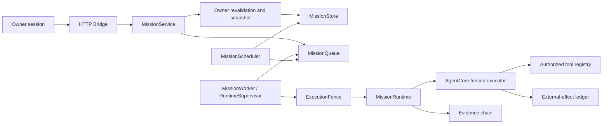

# M3 Runtime Architecture

The implemented runtime is a **single-host, non-HA Python service**: an authenticated HTTP bridge accepts control-plane requests, while a separately supervised worker claims durable mission work and runs the persistent `MissionRuntime`. Owner authorization, worker identity, lease and generation fencing, evidence receipts, and external-effect recovery are separate but connected controls. A hosted Compose rehearsal verifies this repository-owned runtime; it does **not** establish a Cloudflare target, production environment, or authority to deploy.

## Runtime path

`bridge.py` builds `MissionService`, `MissionQueue`, `MissionScheduler`, and a strict `MissionRuntime`; the service is given `AgentCore.prepare_mission_for_queue` as its Owner revalidator. `AgentCore.run_owner_mission` creates an Owner-bound mission and authorization snapshot, then routes synchronous execution through `_run_via_fenced_worker`. That facade constructs a strict queue and a `MissionWorker`; it does not retain a separate `AgentTaskRuntime`/core-engine tool-dispatch path. `AgentCore._executor` refuses a missing fence, checks the active execution, revalidates the tool schema and authorization, and passes the fence to the tool registry. Model output is an untrusted proposal, not authority.

Relevant source: [`bridge.py`](../bridge.py), [`agent/agent_core.py`](../agent/agent_core.py), [`agent/mission_runtime.py`](../agent/mission_runtime.py), [`agent/mission_worker.py`](../agent/mission_worker.py), [`agent/runtime_supervisor.py`](../agent/runtime_supervisor.py), and [`agent/execution_fence.py`](../agent/execution_fence.py).

## Durable state and transaction boundaries

Compose places the runtime's SQLite files, Owner policy state, and workspace under one persistent named volume at `/var/lib/cybersentinel`. The bridge and worker share this state volume. The logical stores remain distinct; being on one volume is not the same as one universal database transaction.

Strict mission/queue claim binding uses SQLite rollback-journal transactions. A strict evidence append attaches the evidence, mission, and queue databases and commits the chain entry together with the mission receipt while rechecking the active fence. Scheduling handoff has its own attached transaction across its scheduling, queue, mission, and Owner-auth stores. The external-effect ledger is durable and fenced, but its state transitions are separate ledger transactions. None of these SQLite transactions can atomically include an external provider's action.

Source: [`agent/mission.py`](../agent/mission.py), [`agent/mission_worker.py`](../agent/mission_worker.py), [`agent/evidence.py`](../agent/evidence.py), [`agent/external_effects.py`](../agent/external_effects.py), and [`agent/effect_reconciliation.py`](../agent/effect_reconciliation.py).

## Container target and scope

[`compose.yaml`](../compose.yaml) defines a one-shot workspace initializer, a bridge, and one mission worker. The image runs as UID/GID 10001; bridge and worker use read-only roots, dropped capabilities, `no-new-privileges`, bounded temporary storage and logs, health checks, and graceful-stop windows. The host publishes the bridge on `127.0.0.1` only by default. Worker replicas are not a supported scale-out model for this SQLite single-host state design.

The test-only V16 Compose overlay blocks providers and injects a bounded worker crash only in an ephemeral project/volume. It is not part of production runtime startup. The exact-SHA hosted rehearsal on `ecd970cbb287d154b0c0ef7635a4d0dffe0991de` passed all twelve lifecycle stages and cleanup; its artifact explicitly sets `production_deployment=PRODUCTION_DEPLOYMENT_BLOCKED`.

## Boundaries and non-claims

- No production host, ingress, domain, Cloudflare Worker entrypoint, production database, or deployment authority was identified.
- The separate Cloudflare Workers Builds check failed; the exact SHA's tests, audit, and isolated rehearsal are distinct checks and do not imply deployment success.
- The architecture does not claim multi-host availability, production monitoring/rollback, provider-side idempotency, or exactly-once delivery to real external providers.
- Scheduled work validates previously stored authorization and fails closed when its Owner proof is no longer usable; M3 does not create a new unattended Owner delegation mechanism.
- Writable-volume path checks are startup invariants, not race-free isolation against a same-UID writer with access to that volume. See [`OPERATIONS.md`](OPERATIONS.md).
