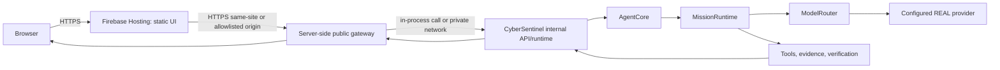

# CyberSentinel X — Secure Public Web Architecture

**Status:** Design baseline for `feature/public-web-secure-boundary`
**Baseline commit:** `f1ed9ae21fe5ff9e806daebc76db8be549ccbe74`
**Scope:** Secure browser boundary and reviewable deployment artifacts only. No Firebase project creation, Firebase login, Cloud Run deployment, billing change, production secret, or provider credential is included.

## 1. Request flow

The target request path is:



Firebase Hosting is responsible for static assets only. The public gateway is the only component that accepts browser API traffic. The existing `AgentCore → MissionRuntime → ModelRouter → Provider` path remains authoritative and is not replaced.

Until a production deployment target and origin are supplied, the gateway's public origin and backend origin are configuration values, not claims of production readiness.

## 2. Authentication flow

A browser visit creates no Owner authority. A public session, if enabled, identifies a browser/client session only; it is not an Owner credential.

The gateway must reject protected operations unless the request carries a valid gateway session and the operation's required CyberSentinel authorization has independently succeeded. The gateway must not accept the words “Owner” or any frontend state as proof of Owner authority.

The current internal `BRIDGE_TOKEN` and `OWNER_TOKEN` remain server-side configuration. They must never be returned to the browser, rendered into public assets, stored in browser storage, or written to logs.

For the current Owner-only chat semantics, an unresolved decision remains: a production-facing Owner login mechanism must be selected before browser users can invoke Owner-authorized chat. Possible choices include an approved identity provider mapped to a CyberSentinel Owner policy, or a private operator-only gateway. The gateway must not silently turn an anonymous public session into an Owner session.

## 3. Session flow

The browser-facing session is an opaque server-managed session represented by a cookie with the following intended attributes:

- `Secure`
- `HttpOnly`
- `SameSite=Lax` for same-site deployment, or an explicitly reviewed alternative for the final cross-site topology
- narrow `Path`
- bounded idle and absolute expiry

The cookie contains only an opaque session identifier or an equally non-sensitive signed reference. Session state is server-side and must not contain raw Owner or provider credentials in client-visible form. Session rotation is required after authentication-state changes. Logout invalidates the server-side session.

The existing `OwnerSession` remains separate. Its challenge, expiry, HMAC proof, single-use behavior, and authorization scope are not replaced by the browser session.

## 4. Owner authorization flow

1. The gateway authenticates the browser session.
2. The gateway determines whether the requested operation is public, authenticated-user, or Owner-only.
3. For Owner-only operations, the gateway invokes the existing Owner authorization path using server-side material or a future approved identity-to-Owner mapping.
4. `OwnerSession`, challenge validation, HMAC proof, expiry, single-use challenge consumption, and scope checks remain enforced by CyberSentinel.
5. Authorization failures remain failures and retain their HTTP error semantics.

No public website visit, Firebase Authentication state, browser cookie by itself, or user-entered phrase grants Owner authority.

## 5. Browser/server trust boundary

The browser is untrusted. It may submit user text, UI state, a request identifier, and non-sensitive conversation metadata. The gateway validates and bounds all input before invoking the internal runtime.

The browser is not trusted to choose authorization scope, Owner status, provider, model, evidence, verification result, or tool permissions. The browser must not receive internal credentials, raw HMAC secrets, internal database paths, or unrestricted internal bridge access.

## 6. Secret boundary

Secrets remain exclusively in server-side runtime configuration or a managed secret-injection mechanism. This includes `BRIDGE_TOKEN`, `OWNER_TOKEN`, API keys, LLM credentials, provider credentials, session-signing secrets, HMAC secrets, and deployment credentials.

The frontend must contain none of these names as operational values and must not prompt for them. Public responses and logs must use redacted error categories and correlation identifiers only.

## 7. CORS model

The preferred topology is same-site browser-to-gateway traffic, which minimizes CORS. If Firebase Hosting and the gateway have different origins, the gateway will use an explicit allowlist configured with the exact Firebase production origin.

Rules:

- no wildcard origin for credentialed requests;
- unknown `Origin` is rejected for browser API requests;
- the configured production origin is allowed only after Owner supplies/approves it;
- localhost development origins, if enabled, are development-only configuration and cannot be included in production defaults;
- allowed methods and headers are narrow and explicit;
- preflight does not disclose secrets or internal routes.

Production CORS is not considered configured until the actual Firebase origin is known.

## 8. CSRF model

If the browser uses an HttpOnly cookie, state-changing requests require CSRF protection. The selected implementation will use one of the following after the deployment topology is fixed:

- a server-issued CSRF token in a non-HttpOnly cookie/header pair with constant-time comparison and origin checking; or
- a reviewed same-site deployment topology with strict `Origin`/`Referer` validation and a narrowly scoped anti-CSRF token.

`SameSite` is defense in depth, not the sole CSRF control. GET endpoints remain side-effect free. The final implementation must test missing, mismatched, and valid CSRF proofs.

## 9. API routing

The browser-facing boundary should use the smallest stable set of routes:

- `POST /api/public/session` — establish or rotate a browser session; no Owner authority;
- `GET /api/public/health` — non-sensitive health response;
- `POST /api/public/chat` — validated chat entry, subject to session and Owner policy;
- `GET /api/public/chat/stream` or a POST-compatible streaming route — only if the final gateway supports safe streaming;
- `POST /api/public/logout` — invalidate the browser session.

The existing internal bridge routes remain internal and must not be exposed as a browser credential workaround. The final implementation may collapse or rename public routes after code inspection, but it must not create a second authorization system.

Every accepted request receives or preserves a validated `request_id`. `mission_id`, when created by the runtime, is returned as response metadata. Payload sizes, text lengths, timeouts, and concurrency are bounded.

## 10. Error propagation

The gateway preserves meaningful failure categories and HTTP status classes. Provider failures, tool failures, authorization failures, MissionRuntime failures, and evidence/verification failures remain failures. The gateway does not manufacture an answer, evidence record, verification result, or success response when the internal runtime failed.

Client responses may redact internal stack traces and secret-bearing details, but they must include a safe error category and `request_id` for correlation. Internal logs retain diagnostic detail only after redaction.

## 11. Streaming strategy

The existing SSE path is retained only if the selected gateway can enforce session, CSRF, timeout, disconnect, and redaction controls for the complete stream. SSE responses must disable sensitive caching, close on session/authorization failure, preserve event ordering, and propagate terminal provider/runtime failure rather than emitting a fabricated completion.

If cross-origin cookie/SSE behavior is not reliably supported by the final topology, the initial public boundary will use a bounded request/response route instead of claiming streaming support.

## 12. Logging and redaction

Structured logs contain timestamp, route category, status, latency, `request_id`, optional `mission_id`, safe failure category, and deployment version. Logs must not contain raw request authorization headers, cookies, Owner tokens, bridge tokens, provider keys, session secrets, HMAC material, or full sensitive prompts.

Correlation identifiers are safe to return only when they do not expose secret material. Error bodies are bounded and sanitized.

## 13. Deployment topology

The reviewable target topology is:

```text
Firebase Hosting (static web assets)
        |
        | HTTPS, exact origin allowlist
        v
Server-side gateway / CyberSentinel service
        |
        | server-side internal credential or in-process runtime call
        v
AgentCore -> MissionRuntime -> ModelRouter -> configured REAL provider
```

The current repository is a Python service and has no container artifact. Cloud Run is a plausible deployment target because it supports a containerized Python HTTP service and managed secret injection, but it may require billing configuration. No Cloud Run service, Firebase project, billing change, or deployment is performed in this phase.

Alternative: an existing private container or VM can host the gateway and runtime if it provides HTTPS, secret injection, health checks, isolation, and an explicit CORS/origin policy. Firebase Hosting remains static-only in either case.

## 14. Rollback strategy

All code changes are isolated to `feature/public-web-secure-boundary`. Rollback is a Git revert or deployment revision rollback to the audited commit. Firebase Hosting, if later configured, must use a versioned release and a prior-release rollback path. Backend revisions must be immutable and health-checked before traffic migration.

No migration may delete existing evidence, conversation state, Owner policy state, or runtime databases. Any session-store migration must be backward-compatible or explicitly invalidated with a documented user impact.

## 15. Threat model

Primary threats are:

- public asset inspection revealing a secret;
- XSS stealing a browser-readable credential;
- CSRF using an ambient cookie to trigger state changes;
- forged or replayed Owner challenges;
- unauthorized access to internal bridge routes;
- origin spoofing or permissive CORS;
- request flooding and oversized payloads;
- provider/tool failure being misreported as success;
- evidence fabricated from failed or null observations;
- log leakage of credentials or sensitive prompts;
- session fixation, replay, or excessive lifetime;
- deployment drift from the reviewed commit.

Controls are server-side secret storage, HttpOnly/Secure cookies, CSRF checks, explicit CORS, session rotation/expiry, existing OwnerSession and authorization checks, request limits, safe logging, failure-preserving response handling, immutable deployment revisions, and tests for each boundary.

## 16. Explicit assumptions

- The audited commit remains the baseline for this branch.
- `AgentCore`, `MissionRuntime`, and `ModelRouter` remain the system of record.
- A Firebase project and production origin are not yet known.
- No production provider credentials are available for this phase.
- Existing local `BRIDGE_TOKEN` and `OWNER_TOKEN` semantics must remain valid internally.
- The public browser should not be able to perform Owner-only operations until an approved Owner identity flow exists.
- Long-session/1000-message continuity is out of scope and will not be claimed.
- Current local tests require installation of project/test dependencies before execution.

## 17. Unresolved Owner decisions

The following decisions require Owner input before deployment or before enabling public Owner-authorized chat:

1. Firebase project ID and authorized Firebase account/project access.
2. Production Firebase Hosting origin/domain.
3. Backend hosting target and acceptance of any billing requirement.
4. Public user identity model and whether public chat is allowed without Owner authority.
5. Approved mapping, if any, from an external identity to CyberSentinel Owner authority.
6. Production session store and retention/expiry policy.
7. Production provider/model and secret-injection source.
8. Whether SSE is required for the first release.
9. Production rate limits and resource limits.
10. Domain ownership and TLS/DNS changes, if a custom domain is desired.

Until these choices are resolved, this design supports reviewable implementation work but does not assert production readiness, security certification, or real end-to-end operation.

## Implementation boundary for this phase

The next safe implementation steps are limited to local, reviewable changes: remove browser token prompts/storage, add a server-side public-boundary skeleton that fails closed when no approved Owner mapping exists, add security tests and documentation, and prepare deployment artifacts without deployment. Any step requiring Firebase login/project ID, production secret, Cloud Run creation, billing, domain ownership, or changed Owner semantics must stop for Owner decision.
