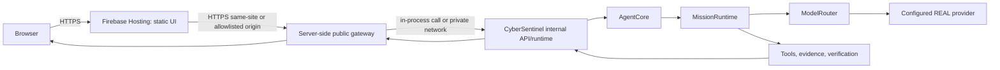

# CyberSentinel X — Secure Public Web Architecture

**Status:** Local browser boundary implemented; production deployment remains unconfigured.
**Implementation baseline:** `main` at `8a3fd10`; see [`CURRENT_RUNTIME_TRUTH.md`](CURRENT_RUNTIME_TRUTH.md) for the current code path.
**Scope:** Same-process, loopback browser access with Owner password authentication. No Firebase project creation, Cloud Run deployment, billing change, production secret, or provider credential is included.

## 1. Request flow

The target request path is:


```mermaid
flowchart LR
    B[Browser] -->|HTTPS| F[Firebase Hosting: static UI]
    F -->|HTTPS same-site or allowlisted origin| G[Server-side public gateway]
    G -->|in-process call or private network| C[CyberSentinel internal API/runtime]
    C --> A[AgentCore]
    A --> M[MissionRuntime]
    M --> R[ModelRouter]
    R --> P[Configured REAL provider]
    M --> E[Tools, evidence, verification]
    E --> C
    C --> G
    G --> B
```

Firebase Hosting is responsible for static assets only. The public gateway is the only component that accepts browser API traffic. The existing `AgentCore → MissionRuntime → ModelRouter → Provider` path remains authoritative and is not replaced.

Until a production deployment target and origin are supplied, the gateway's public origin and backend origin are configuration values, not claims of production readiness.

## 2. Authentication flow

A browser visit creates no Owner authority. `POST /api/public/session` issues an in-memory, short-lived public session and a CSRF token; that session is not an Owner credential.

`POST /api/public/auth/login` checks the Owner username/password with the existing `security/owner_password.py` verifier and creates the canonical server-side Owner session. Successful login sets the opaque session ID only in a separate `HttpOnly; Secure; SameSite=Lax` cookie. The response returns the username and expiry but not the session ID. Browser chat requires both the public CSRF proof and a valid Owner cookie, then calls the existing `api.chat.chat` path. Logout requires CSRF validation and revokes the Owner session. The gateway does not accept the word “Owner” or frontend state as proof of identity.

`BRIDGE_TOKEN` remains a server-side internal transport credential and is never returned to the browser, rendered into assets, stored in browser storage, or written to logs. There is no live `OWNER_TOKEN` environment credential; Owner authentication is account-backed and session-based.

## 3. Session flow

The browser uses two separate server-managed sessions: a public CSRF session and a canonical Owner authentication session. The Owner session is represented by a cookie with these attributes:

- `Secure`
- `HttpOnly`
- `SameSite=Lax` for same-site deployment, or an explicitly reviewed alternative for the final cross-site topology
- narrow `Path`
- bounded idle and absolute expiry

The cookie contains only an opaque session identifier or an equally non-sensitive signed reference. Session state is server-side and must not contain raw Owner or provider credentials in client-visible form. Session rotation is required after authentication-state changes. Logout invalidates the server-side session.

The public session cookie contains no authority. Owner session expiry and revocation are enforced by `security/owner_password.py` and its SQLite tables; the public web layer does not replace or bypass that authentication module.

## 4. Owner authorization flow

1. The gateway validates the public session and CSRF token for state-changing browser requests.
2. Owner login verifies the username/password through `security.owner_password.login` and issues a server-side session.
3. Owner-only chat resolves the cookie to that existing Owner session and passes its session ID to `api.chat.chat`.
4. The chat path retains its MissionRuntime authorization, scope, evidence, and verification checks.
5. Anonymous or expired sessions remain denied; logout revokes the session and expires the cookie.

No public website visit, Firebase Authentication state, browser cookie by itself, or user-entered phrase grants Owner authority.

## 5. Browser/server trust boundary

The browser is untrusted. It may submit user text, UI state, a request identifier, and non-sensitive conversation metadata. The gateway validates and bounds all input before invoking the internal runtime.

The browser is not trusted to choose authorization scope, Owner status, provider, model, evidence, verification result, or tool permissions. The browser must not receive internal credentials, raw HMAC secrets, internal database paths, or unrestricted internal bridge access.

## 6. Secret boundary

Secrets remain exclusively in server-side runtime configuration or a managed secret-injection mechanism. This includes `BRIDGE_TOKEN`, API keys, LLM credentials, provider credentials, Owner session identifiers, HMAC secrets, and deployment credentials.

The frontend must contain none of these names as operational values and must not prompt for them. Public responses and logs must use redacted error categories and correlation identifiers only.

## 7. CORS model

The implemented UI and gateway use the same origin. `PUBLIC_WEB_ORIGIN` can restrict the accepted `Origin` header, but the current service does not emit CORS headers or handle preflight; setting that value alone does not make a separate static host usable.

Rules:

- no wildcard origin for credentialed requests;
- unknown or foreign `Origin` is rejected for browser API requests;
- a configured `PUBLIC_WEB_ORIGIN` is an exact origin check, not a CORS policy;
- localhost development origins, if enabled, are development-only configuration and cannot be included in production defaults;
- allowed methods and headers are narrow and explicit;
- preflight does not disclose secrets or internal routes.

Cross-origin browser access is not implemented. A future deployment with separate static and API origins needs reviewed CORS/preflight behavior and tests in addition to this origin check.

## 8. CSRF model

If the browser uses an HttpOnly cookie, state-changing requests require CSRF protection. The selected implementation will use one of the following after the deployment topology is fixed:

- a server-issued CSRF token in a non-HttpOnly cookie/header pair with constant-time comparison and origin checking; or
- a reviewed same-site deployment topology with strict `Origin`/`Referer` validation and a narrowly scoped anti-CSRF token.

`SameSite` is defense in depth, not the sole CSRF control. GET endpoints remain side-effect free. The final implementation must test missing, mismatched, and valid CSRF proofs.

## 9. API routing

The browser-facing boundary should use the smallest stable set of routes:

- `POST /api/public/session` — establish a browser CSRF session; no Owner authority;
- `POST /api/public/auth/login` — validate Owner username/password and set the HttpOnly Owner-session cookie;
- `GET /api/public/auth/session` — return only authenticated state, username, and expiry;
- `POST /api/public/auth/logout` — revoke the Owner session and clear its cookie;
- `GET /api/public/health` — non-sensitive health response;
- `POST /api/public/chat` — validated chat entry, subject to CSRF and existing Owner authorization;
- `GET /api/public/chat/stream` or a POST-compatible streaming route — only if the final gateway supports safe streaming;
- `POST /api/public/logout` — invalidate the browser session.

The existing internal bridge routes remain internal and must not be exposed as a browser credential workaround. The final implementation may collapse or rename public routes after code inspection, but it must not create a second authorization system.

Every accepted request receives or preserves a validated `request_id`. `mission_id`, when created by the runtime, is returned as response metadata. Payload sizes, text lengths, timeouts, and concurrency are bounded.

## 10. Error propagation

The gateway preserves meaningful failure categories and HTTP status classes. Provider failures, tool failures, authorization failures, MissionRuntime failures, and evidence/verification failures remain failures. The gateway does not manufacture an answer, evidence record, verification result, or success response when the internal runtime failed.

Client responses may redact internal stack traces and secret-bearing details, but they must include a safe error category and `request_id` for correlation. Internal logs retain diagnostic detail only after redaction.

## 11. Streaming strategy

The existing SSE path is retained only if the selected gateway can enforce session, CSRF, timeout, disconnect, and redaction controls for the complete stream. SSE responses must disable sensitive caching, close on session/authorization failure, preserve event ordering, and propagate terminal provider/runtime failure rather than emitting a fabricated completion.

If cross-origin cookie/SSE behavior is not reliably supported by the final topology, the initial public boundary will use a bounded request/response route instead of claiming streaming support.

## 12. Logging and redaction

Structured logs contain timestamp, route category, status, latency, `request_id`, optional `mission_id`, safe failure category, and deployment version. Logs must not contain raw request authorization headers, cookies, Owner tokens, bridge tokens, provider keys, session secrets, HMAC material, or full sensitive prompts.

Correlation identifiers are safe to return only when they do not expose secret material. Error bodies are bounded and sanitized.

## 13. Deployment topology

The reviewable target topology is:

```text
Firebase Hosting (static web assets)
        |
        | HTTPS, exact origin allowlist
        v
Server-side gateway / CyberSentinel service
        |
        | server-side internal credential or in-process runtime call
        v
AgentCore -> MissionRuntime -> ModelRouter -> configured REAL provider
```

The current repository is a Python service and has no container artifact. Cloud Run is a plausible deployment target because it supports a containerized Python HTTP service and managed secret injection, but it may require billing configuration. No Cloud Run service, Firebase project, billing change, or deployment is performed in this phase.

Alternative: an existing private container or VM can host the gateway and runtime if it provides HTTPS, secret injection, health checks, isolation, and an explicit CORS/origin policy. Firebase Hosting remains static-only in either case.

## 14. Rollback strategy

All code changes are isolated to `feature/public-web-secure-boundary`. Rollback is a Git revert or deployment revision rollback to the audited commit. Firebase Hosting, if later configured, must use a versioned release and a prior-release rollback path. Backend revisions must be immutable and health-checked before traffic migration.

No migration may delete existing evidence, conversation state, Owner policy state, or runtime databases. Any session-store migration must be backward-compatible or explicitly invalidated with a documented user impact.

## 15. Threat model

Primary threats are:

- public asset inspection revealing a secret;
- XSS stealing a browser-readable credential;
- CSRF using an ambient cookie to trigger state changes;
- forged or replayed Owner challenges;
- unauthorized access to internal bridge routes;
- origin spoofing or permissive CORS;
- request flooding and oversized payloads;
- provider/tool failure being misreported as success;
- evidence fabricated from failed or null observations;
- log leakage of credentials or sensitive prompts;
- session fixation, replay, or excessive lifetime;
- deployment drift from the reviewed commit.

Controls are server-side secret storage, HttpOnly/Secure cookies, CSRF checks, explicit CORS, session rotation/expiry, existing OwnerSession and authorization checks, request limits, safe logging, failure-preserving response handling, immutable deployment revisions, and tests for each boundary.

## 16. Explicit assumptions

- The audited commit remains the baseline for this branch.
- `AgentCore`, `MissionRuntime`, and `ModelRouter` remain the system of record.
- A Firebase project and production origin are not yet known.
- No production provider credentials are available for this phase.
- `BRIDGE_TOKEN` remains an internal transport credential; Owner identity is established by the existing username/password account and session flow.
- The local browser Owner login is not a production identity provider, and the bridge remains bound to loopback.
- Long-session/1000-message continuity is out of scope and will not be claimed.
- Current local tests require installation of project/test dependencies before execution.

## 17. Production decisions still open

The following decisions require Owner input before deployment or before enabling public Owner-authorized chat:

1. Firebase project ID and authorized Firebase account/project access.
2. Production Firebase Hosting origin/domain.
3. Backend hosting target and acceptance of any billing requirement.
4. Whether an external identity provider is needed for any future multi-user production deployment; the local browser uses the canonical Owner password flow.
5. Production session store and retention/expiry policy.
6. Production provider/model and secret-injection source.
7. Whether SSE is required for any deployed browser boundary.
8. Production rate limits and resource limits.
9. Domain ownership and TLS/DNS changes, if a custom domain is desired.

Until these choices are resolved, the local implementation must not be described as production-ready, security-certified, or deployed to Firebase/Cloud Run.

## Implementation boundary for this phase

The local implementation now includes password login, cookie-backed Owner sessions, CSRF/origin checks, authenticated chat, logout, and HTTP regression tests. Any step requiring Firebase login/project ID, production secrets, Cloud Run creation, billing, domain ownership, or new identity semantics remains outside this implementation and requires separate authorization.

The current local bridge serves both the static UI and its API from the same loopback origin. The Firebase/static-hosting diagram below remains a future deployment target, not the present runtime.
